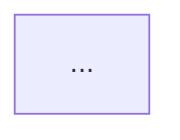

# Code Structure Analyzer (CSA)


A Python CLI application that analyzes codebases and generates structured documentation
as markdown files or a ChromaDB vector database using local LLMs and is aimed for small
codebases (like couple of hundred source files).

## Dev Notes

This tool has been developed using both LM Studio and Ollama as LLM providers.
The idea behind using a local LLM, like Google's Gemma-3 1B, is data privacy and
low cost. In addition, with a good LLM a multitude of programming  languages can
be analyzed without depending on specific code parsers.
Depending on the available hardware and used model, though, performance may
vary and accuracy may be affected.

There's lots of tweaking done to format and process the LLM's responses, but depending
on the source there may still some warnings. An LLM may not always format code
within JSON replies correctly, then one enty might be skipped.

Output was initially only aimed for markdown files, but has since been extended
to also allow a vector database (ChromaDB), that can be queried against
(see a small test script in the examples folder).

An example output file can be found [here](./trace_ai.md), which is an analysis
of the CSA project itself as of March, 17th 2025.

This repository is experimental and was developed almost entirely using Claude 3.7 Sonnet AI.
The code structure, documentation, and implementation reflect an AI-assisted development
approach, showcasing the capabilities of modern LLMs in software engineering.

## Features

- Recursively scans source directories for code files
- Filters files by extension and excludes binary/generated folders
- Analyzes code files in chunks using local LLM's (via LMStudio or Ollama)
- Generates either Markdown or ChromaDB vector database documentation with:
  - File structure visualization (Mermaid diagram)
  - File-by-file analysis summaries
- User-friendly CLI with:
  - Comprehensive help documentation with usage examples
  - Optional file inclusion/exclusion patterns
- LM Studio and Ollama integration:
  - Smart extraction of content from LLM responses
  - Multiple fallback mechanisms for resilient operation
- Extensible output formats through the reporter pattern
- Clean markdown output
- Optional logging (csa.log)
- Supports gitignore-based file exclusion
- Custom chunk sizing for optimal LLM context utilization
- Environment variable configuration via .env files
- Cross-platform compatibility (Windows, Linux, WSL2)
- Extensive test suite with unit and integration tests
- Efficient error handling and recovery mechanisms

## Requirements

- Python 3.10 or later
- One of the following LLM providers:
  - LM Studio running locally (default, configure with LMSTUDIO_HOST)
  - Ollama running locally (configure with OLLAMA_HOST and OLLAMA_MODEL)

## Installation

### Windows

1. Clone this repository
2. Run `setup.bat` to create a virtual environment and install dependencies
3. Make sure one of the following LLM providers is running:
   - LM Studio on localhost:1234 (default)
   - Ollama on localhost:11434

### Linux/WSL2

1. Clone this repository
2. Make the shell scripts executable:

   ```bash
   chmod +x setup.sh run_tests.sh
   ```

3. Run `./setup.sh` to create a virtual environment and install dependencies
4. Make sure one of the following LLM providers is running:
   - LM Studio on localhost:1234 (default)
   - Ollama on localhost:11434

### Manual Installation

1. Clone this repository
2. Create a virtual environment: `python -m venv venv`
3. Activate the virtual environment:
   - Windows: `venv\Scripts\activate`
   - Linux/WSL2: `source venv/bin/activate`
4. Install dependencies: `pip install -r requirements.txt`
5. In folder `csa` create `.env` file from `.env.example`

## Usage

Basic usage:

```bash
# Using the Python module directly
python -m csa.cli /path/to/source/directory

# Or if installed via pip
csa /path/to/source/directory
```

This will analyze the codebase in the specified directory and generate a `trace_ai.md` file in the current directory.

### Command-line Options

```bash
usage: python -m csa.cli [-h] [-o OUTPUT] [-c CHUNK_SIZE] [--folders]
              [--reporter {markdown,chromadb}] [--llm-provider LLM_PROVIDER]
              [--llm-host LLM_HOST] [--lmstudio-host LMSTUDIO_HOST]
              [--ollama-host OLLAMA_HOST] [--include INCLUDE]
              [--exclude EXCLUDE] [--obey-gitignore] [--no-dependencies]
              [--no-functions] [--verbose]
              [source_dir]

Code Structure Analyzer - Generate structured documentation for codebases

positional arguments:
  source_dir            Path to the source directory to analyze

optional arguments:
  -h, --help            Show this help message and examples.
  -o OUTPUT, --output OUTPUT
                        Path to the output markdown file or chromadb directory (default: trace_ai.md)
  -c CHUNK_SIZE, --chunk-size CHUNK_SIZE
                        Number of lines to read in each chunk (default: 200)
  --folders             Recursively include files in sub-folders of the source directory.
  --reporter            Reporter type to use (markdown or chromadb) - for chromadb, the -o/--output must specify a folder name (e.g., "data")
  --llm-provider LLM_PROVIDER
                        LLM provider to use (default: lmstudio)
  --llm-host LLM_HOST   Legacy host for selected provider (fallback only when provider-specific host is not explicitly set)
  --lmstudio-host LMSTUDIO_HOST
                        Host address for the LM Studio provider (default: localhost:1234); overrides --llm-host
  --ollama-host OLLAMA_HOST
                        Host address for Ollama (default: localhost:11434); overrides --llm-host
  --include INCLUDE     Comma-separated list in double quotes of file patterns to include (gitignore style)
  --exclude EXCLUDE     Comma-separated list in double quotes of file patterns to exclude (gitignore style)
  --obey-gitignore      Whether to obey .gitignore files in the processed folder
  --no-dependencies     Disable output of dependencies/imports in the analysis
  --no-functions        Disable output of functions list in the analysis
  --verbose, -v         Enable verbose logging
```

### Examples

```bash
# Analyze the current directory with default settings
python -m csa.cli .

# Analyze a specific directory with a custom output file
python -m csa.cli /path/to/source -o analysis.md

# Analyze with a larger chunk size (for processing more lines at once)
python -m csa.cli /path/to/source -c 200

# Analyze recursively including all sub-folders
python -m csa.cli /path/to/source --folders

# Show detailed help text with examples
python -m csa.cli --help

# Use LM Studio with a specific host
python -m csa.cli /path/to/source --llm-provider lmstudio --lmstudio-host localhost:1234

# Use Ollama as the LLM provider with specific host and model
python -m csa.cli /path/to/source --llm-provider ollama --ollama-host localhost:11434 --ollama-model qwen2.5-coder:14b

# Use legacy --llm-host as a fallback for the selected provider
python -m csa.cli /path/to/source --llm-provider lmstudio --llm-host localhost:5000

# Provider-specific host flags take precedence over --llm-host
python -m csa.cli /path/to/source --llm-provider lmstudio --llm-host localhost:5000 --lmstudio-host localhost:1234

# Include only specific file patterns
python -m csa.cli /path/to/source --include "*.cs,*.py"

# Exclude specific file patterns
python -m csa.cli /path/to/source --exclude "test_*.py,*.tmp"

# Obey .gitignore files in the processed folder
python -m csa.cli /path/to/source --obey-gitignore

# Disable dependencies/imports in the output
python -m csa.cli /path/to/source --no-dependencies

# Disable functions list in the output
python -m csa.cli /path/to/source --no-functions
```

## Architecture

CSA employs several architectural patterns to ensure maintainability and extensibility:

### Reporter Pattern

The application uses a reporter pattern to separate analysis logic from output formatting:

- `BaseAnalysisReporter`: Abstract base class defining the interface for all reporters
- `MarkdownAnalysisReporter`: Concrete implementation that formats analysis results as Markdown

This design allows for:

- Easy addition of new output formats (HTML, JSON, etc.)
- Clear separation of concerns
- Better testability of individual components

If you want to create your own output format, simply:

1. Subclass `BaseAnalysisReporter`
2. Implement the required methods (`initialize`, `update_file_analysis`, `finalize`)
3. Pass your reporter instance to `analyze_codebase()`

### LLM Provider Abstraction

The application supports multiple LLM providers through a provider abstraction:

- `LLMProvider`: Base class for all LLM providers
- Provider-specific implementations for LM Studio, Ollama, etc.

This allows for easy integration of new LLM backends while maintaining a consistent interface.

### Code Analysis Pipeline

The code analysis process follows a pipeline approach:

1. File discovery and filtering
2. File chunking to fit within LLM context windows
3. Analysis of each chunk with LLM
4. Aggregation of chunk analyses into a comprehensive file analysis
5. Output generation via the reporter system

## Testing

The project includes test scripts for both Windows and Linux environments:

### Windows Tests

Run tests using the batch script:

```bash
run_tests.bat             # Run unit tests only
run_tests.bat --all       # Run all tests (including integration tests)
run_tests.bat --integration  # Run only integration tests
```

### Linux/WSL2 Tests

First, ensure the shell script is executable:

```bash
chmod +x run_tests.sh
```

Then run tests:

```bash
./run_tests.sh            # Run unit tests only
./run_tests.sh --all      # Run all tests (including integration tests)
./run_tests.sh --integration  # Run only integration tests
```

Note: Integration tests require a running LLM provider. By default, they expect LM Studio running on localhost:1234, but this can be configured through environment variables.

## Development

If you're interested in contributing to CSA, follow these steps to set up your development environment:

### Setting Up Development Environment

1. Clone this repository and navigate to it
2. Create a virtual environment:

   ```bash
   python -m venv .venv
   ```

3. Activate the virtual environment:
   - Windows (Command Prompt):

     ```cmd
     .venv\Scripts\activate
     ```

   - Windows (Git Bash):

     ```bash
     source .venv/Scripts/activate
     ```

   - Linux/macOS:

     ```bash
     source .venv/bin/activate
     ```

4. Install project dependencies:

   ```bash
   pip install -r requirements.txt
   ```

5. Install development dependencies including pre-commit hooks:

   ```bash
   pip install pre-commit==3.7.0
   pip install ruff mypy types-requests types-setuptools types-pyyaml types-toml
   ```

6. Set up pre-commit hooks:

   ```bash
   pre-commit run --config ./dev_config/python/.pre-commit-config.yaml --all-files
   ```

### Running Pre-commit Hooks Manually

To manually run the linting/pre-commit tools from Git Bash:

1. First, activate your virtual environment:

   ```bash
   source .venv/Scripts/activate
   ```

2. Run the full pre-commit suite:

   ```bash
   pre-commit run --config ./dev_config/python/.pre-commit-config.yaml --all-files
   ```

    This will:

    - Format your code with Ruff
    - Run linting checks
    - Check for type errors with MyPy
    - Fix common issues automatically

3. To run specific hooks individually:

   ```bash
   # Run just the ruff linter
   pre-commit run ruff --config ./dev_config/python/.pre-commit-config.yaml --all-files

   # Run just the ruff formatter
   pre-commit run ruff-format --config ./dev_config/python/.pre-commit-config.yaml --all-files

   # Run just the mypy type checker
   pre-commit run mypy --config ./dev_config/python/.pre-commit-config.yaml --all-files
   ```

4. Run the linting tools directly (without pre-commit):

   ```bash
   # Run ruff linter
   ruff check --config dev_config/python/ruff.toml .

   # Run ruff formatter
   ruff format --config dev_config/python/ruff.toml .

   # Run mypy type checker
   mypy --config-file dev_config/python/mypy.ini .
   ```

If you want to run these tools on specific files instead of the entire project, replace the `--all-files` flag with the path to the specific files, or provide the file path directly to the linting tools.

## Configuration

Configuration is handled through environment variables or a `.env` file:

- `LLM_PROVIDER`: LLM provider to use (default: "lmstudio")
- `LMSTUDIO_HOST`: Host address for the LMStudio provider (default: "localhost:1234")
- `OLLAMA_HOST`: Host address for the Ollama provider (default: "localhost:11434")
- `OLLAMA_MODEL`: Model name for Ollama (default: "qwen2.5-coder:14b")
- `CHUNK_SIZE`: Number of lines to read in each chunk (default: 200)
- `OUTPUT_FILE`: Default output file path (default: "trace_ai.md", resolved relative to the current working directory when not absolute)
- `FILE_EXTENSIONS`: Comma-separated list of file extensions to analyze (default: ".cs,.py,.js,.ts,.html,.css")

## Project Structure

```txt
csa/
+-- setup.bat                # Windows setup script
+-- setup.sh                 # Linux/WSL2 setup script
+-- requirements.txt         # Dependencies
+-- pyproject.toml           # Python project configuration
+-- setup.py                 # Legacy setup file for compatibility
+-- csa/                     # Python package
|   +-- .env.example         # Example environment variables
|   +-- __init__.py          # Package initialization
|   +-- config.py            # Configuration handling
|   +-- llm.py               # LLM wrapper for different providers
|   +-- analyzer.py          # Core file analysis logic
|   +-- code_analyzer.py     # Code analysis
|   +-- reporters.py         # Output formatting abstraction
|   +-- cli.py               # Command-line interface (entry point)
+-- tests/                   # Test directory
+-- run_tests.bat            # Windows test script
+-- run_tests.sh             # Linux/WSL2 test script
+-- README.md                # Documentation
```

## Example Output

The generated `trace_ai.md` file will have the following structure:

```markdown
# Code Structure Analysis

Source directory: `/path/to/source/directory`
Analysis started: 2023-06-10 14:30:45

## Codebase Structure



## Files Analyzed

```txt
<details>
<summary>path/to/file.cs</summary>

- **Lines Analyzed**: 1-150 of 150
- **Description**: This file contains a class that implements the IDisposable interface...

</details>
```

## Credits

Special credits to X user [shannonNullCode](https://x.com/shannonNullCode/status/1899257896249991314) for the initial idea and inspiration for this project.

- [LM Studio](https://lmstudio.ai/) for their LM Studio and Python SDK
- [Mermaid](https://mermaid-js.github.io/) for the diagramming library

## License

MIT License - This software is provided "as is" without warranty of any kind, express or implied, and you are free to use, modify, and distribute it under the terms of the MIT License. See the LICENSE file for the full text of the MIT License, which grants permissions to use, copy, modify, merge, publish, distribute, sublicense, and/or sell copies of the Software.

## Contributing

Contributions are welcome! Please feel free to submit a Pull Request.
