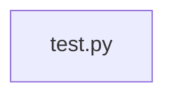

# Code Structure Analysis

Source directory: `C:\Users\tobias\AppData\Local\Temp\tmpk87rmgij`

Analysis started: 2025-03-18 00:17:38

## Files Analyzed

______________________________________________________________________

## 📄 test.py

**File Test:**

This file contains a simple Python script designed for basic testing. It includes a function `print("Hello, World!")` and a function `hello()`. The code is currently empty, lacking any dependencies or further functionality.

### test.py - **Classes**

- None

### test.py - **Functions/Methods**

- hello():
- print("Hello, World!")

### test.py - **Dependencies/Imports**

- None

## Codebase Structure

