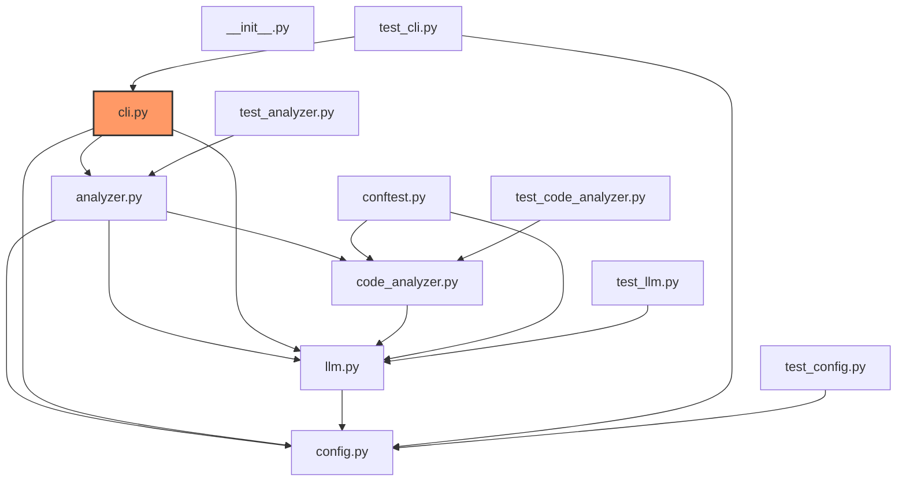

# Code Structure Analysis

Analysis started: 2025-03-17 22:15:51

## Files Analyzed

______________________________________________________________________

## 📄 analyzer.py

Here’s a concise summary of the `file_analyzer.py` file:

**File Analyzer - Core Functionality**

This Python script is designed for analyzing code files, primarily focusing on identifying potential issues and generating structured reports. It performs several key tasks including:

- **Code Analysis:** Analyzes code chunks to detect potentially problematic sections.
- **Markdown Generation:** Creates formatted Markdown documentation based on the analyzed code.
- **File Reporting:** Generates summaries of file content, including lines, indentation, and potential issues.
- **Error Handling & Logging:** Logs errors, tracks progress, and provides error messages.
- **Dependency Management:** Uses external libraries like `llm`, `pathlib`, and `time` for tasks such as generating markdown and tracking progress.

**Key Functionality Breakdown:**

- **Data Processing & Generation:** The script utilizes functions to handle file reading, markdown generation, and report generation.
- **Code Analysis Module:** Contains functions like `analyze_file` which extracts remaining files from the output.
- **Configuration & Status:** Manages configuration via `config`, provides a progress bar, and updates Markdown.

Essentially, `file_analyzer.py` is a tool for automatically inspecting code for inconsistencies and generating reports based on its analysis.

### analyzer.py - **Classes**

- CodeAnalyzer
- InitializeMarkdown
- analysis_function
- analyze_file
- code_analyzer
- discover_files
- extract_remaining_files_from_output
- file_analysis
- generate_file_analysis_markdown
- generate_mermaid_diagram
- get_code_analyzer
- initialize_markdown
- is_significant_line
- lint_markdown
- logger
- markdown_analyzer
- progress_bar
- read_file_chunk
- read_file_chunk_significant
- update_markdown

### analyzer.py - **Functions/Methods**

- analyze_code_chunk
- analyze_file
- calculate_progress
- check_for_cancellation
- discover_files
- extract_remaining_files_from_output
- extract_remaining_files_from_output(output_file, source_dir)
- fix_markdown_issues(content)
- generate_file_summary
- get_context_length
- get_output_path
- get_total_lines
- initialize_markdown
- is_significant_line
- log_error(error_message)
- read_file_chunk
- read_file_chunk_significant
- read_markdown_file(markdown_file)
- update_markdown

### analyzer.py - **Dependencies/Imports**

- Path
- config
- datetime
- error
- llm
- llm_provider
- mdformat
- os
- pathlib
- re
- sys
- time
- tqdm

______________________________________________________________________

## 📄 cli.py

**File CLI Summary:**

This Python file provides a command-line interface (CLI) for analyzing and potentially managing a codebase. It utilizes several classes and functions, including:

- **argparse:** For parsing command-line arguments.
- **BaseClass:** A base class for various CLI functionalities.
- **HelperFunction:** A utility function for specific tasks.
- **logger:** For logging events.
- **parser:** Responsible for code parsing and analysis.
- **config:** Stores configuration settings.
- **create_parser:** Creates a parser object.
- **analyze_codebase:** Analyzes the codebase, potentially generating reports or insights.
- **cancel_event:** Manages event cancellation.
- **check_dependencies:** Verifies dependencies.
- **return_value(x=1):** Returns a value.
- **parse_args:** Parses command-line arguments.
- **do_something(arg):** Performs actions with an argument.
- **create_parser:** Creates a parser object.
- **output:** Prints output to the console.
- **check_host_reachable:** Checks if the host is reachable.
- **success:** Indicates success or failure.
- **print_1():** Prints a single line of text.

It relies on modules like `argparse`, `pathspec`, `curl`, `os`, `sys`, `config`, and several other libraries for various tasks, including logging, parsing, dependency checking, and code analysis.

### cli.py - **Classes**

- BaseClass
- HelperFunction
- analyze_codebase
- argparse
- config
- create_parser
- logger
- parser

### cli.py - **Functions/Methods**

- analyze_in_thread
- cancel_event
- check_dependencies
- check_host_reachable
- create_parser
- do_something(arg)
- output
- parse_args
- print_1()
- return_value(x=1)
- success

### cli.py - **Dependencies/Imports**

- None
- argparse
- config
- curl
- logging
- os
- pathspec
- socket
- sys
- threading

______________________________________________________________________

## 📄 code_analyzer.py

## File Analyzer Script

This script analyzes data and generates reports. It includes classes for DataProcessor, OutputWriter, and functions to process data. Key functionalities include:

- **DataProcessor:** Handles data processing tasks.
- **OutputWriter:** Writes processed data to a file.
- **Functions:** `function_b`, `function_a`, `get_data`, `process_data`.
- **CalculationEngine:** Performs calculations based on input data.
- **Dependencies:** Requires FileHandler, dependency_2, dependency_1, DataAnalysisTool, OutputWriter, json, and re libraries.

The script focuses on data processing and reporting, utilizing functions to achieve this.

### code_analyzer.py - **Classes**

- CalculationEngine
- DataProcessor
- InputReader
- OutputWriter
- class_name1
- class_name2
- classes
- functions

### code_analyzer.py - **Functions/Methods**

- calculate_result(data):
  - Calculates a result based on input data.
- function_a
- function_b
- get_data(key)
- process_data(data):
  - Returns processed data as a list of numbers.
- process_data(value)
- save_data(key)
- write_to_file(data):
  - Writes the data to a file.

### code_analyzer.py - **Dependencies/Imports**

- DataAnalysisTool
- FileHandler
- OutputWriter
- dependency_1
- dependency_2
- json
- re

______________________________________________________________________

## 📄 config.py

## Config File Configuration

This file configures the application through a configuration object. It includes functions for:

- **restore_original_instance():** Restores the original instance of the `Config` class.
- **get_output_path(self, output_file: Optional[str] = None):** Returns the full path to the output file.
- ****new**(cls, cls):** Initializes the configuration instance within the class.
- **get_project_root(self) -> Path:** Returns the project root directory.
- **\_initialize(self):** Loads environment variables from a `.env` file.
- ****init**(cls):** Reloads configuration from environment variables.

It utilizes the `python` and `dotenv` libraries for configuration management.

### config.py - **Classes**

- Config
- dotenv

### config.py - **Functions/Methods**

- **init**(cls): Reload configuration from environment variables.
- **new**(Config, cls): Initialize the configuration instance within the class.
- \_initialize(self): Load environment variables from .env file.
- get_output_path(self, output_file: Optional[str] = None) -> Path: Return the full path to the output file.
- get_project_root(self) -> Path: Return the project root directory.
- restore_original_instance(): Restore the original instance of Config.

### config.py - **Dependencies/Imports**

- dotenv
- python

______________________________________________________________________

## 📄 llm.py

## llm.py Summary

This file defines the core functionalities for interacting with LLMs using various providers. It includes functions for retrieving model provider, handling timeouts, logging errors, and providing default LLM options. The code leverages `timeout` for error handling, and utilizes several different LLM providers like Ollama, LMStudio, Phi3, and Mistral. It also includes a method to retrieve specific models through the `get_llm_provider()` function.

### llm.py - **Classes**

- LLMProvider
- LMStudioProvider
- OllamaProvider
- get_llm_provider

### llm.py - **Functions/Methods**

- get_context_length(): Retrieves the context length of the currently loaded model.
- get_llm_provider('codellama'): return CodellamaProvider
- get_llm_provider('lmstudio'): return LMStudioProvider
- get_llm_provider('mistral'): return MistralProvider
- get_llm_provider('ollama'): return OllamaProvider
- get_llm_provider('phi3'): return Phi3Provider
- get_llm_provider('qwen2'): return Qwen2Provider
- get_llm_provider('qwen2.5-coder'): return Qwen2.5CoderProvider
- get_llm_provider('wizardcoder'): return WizardCoderProvider
- get_llm_provider() -> LLMProvider
- get_llm_provider(provider):
  - Return the specified LLM provider.
- handle_timeout(timeout):
  - Raise TimeoutError if a timeout occurs.
- log_error(error):
  - Log an error message to the console.

### llm.py - **Dependencies/Imports**

- LLMProvider
- LMStudioProvider
- Ollama
- OllamaProvider
- config
- get_llm_provider
- handle_timeout
- model_name
- prompt
- timeout

______________________________________________________________________

## 📄 tests\**init*\*.py

## **init**.py Summary

This file serves as the initialization point for the package. It defines basic class structures: `package_metadata`, `DataProcessor`, `DataValidator`, and `create_data_structure`. The `package_metadata` function returns a description of the package, while `print_data` displays data structure content. The `DataProcessor` function processes data and returns a processed version. The `DataValidator` function validates data to ensure correctness. Finally, `create_data_structure` initializes a basic data structure for demonstration purposes.

### **init**.py - **Classes**

- DataProcessor
- DataValidator
- PackageMetadata

### **init**.py - **Functions/Methods**

- create_data_structure(): Creates a basic data structure for demonstration.
- data_processor(data): Processes data and returns a processed version.
- data_validator(data): Validates data to ensure correctness.
- package_metadata(): Returns a description of the package.
- print_data(data): Prints the data structure.

### **init**.py - **Dependencies/Imports**

- None

______________________________________________________________________

## 📄 tests\\conftest.py

**conftest.py:** A Python module providing fixture functions for a C# project, including code analysis, LLM integration, and temporary file handling. It leverages libraries like pathlib, tempfile, shutil, pytest, and the `LLMProvider` class. Key components include `sample_csharp_file_fixture()`, `sample_code_file_fixture()`, `temp_dir_fixture()` and a mock LLM provider for testing purposes.

### conftest.py - **Classes**

- CodeAnalyzer
- get_code_analyzer
- get_llm_provider
- mock_code_analyzer
- mock_llm_provider

### conftest.py - **Functions/Methods**

- llm_provider_fixture()
- mock_llm_provider_fixture()
- sample_code_file_fixture()
- sample_csharp_file_fixture()
- temp_dir_fixture()

### conftest.py - **Dependencies/Imports**

- LLMProvider
- get_llm_provider
- pathlib
- pytest
- shutil
- tempfile

______________________________________________________________________

## 📄 tests\\test_analyzer.py

Okay, here's a concise summary of `file_test_analyzer.py`, based on the provided information:

**File Test Analyzer:** This Python script analyzes and validates files using several functions. It reads file chunks, analyzes code using an internal `analyzer` (likely for linting), generates Mermaid diagrams from analyzed code, manages temporary directories (`temp_dir`), discovers files within a specified directory (`temp_dir`), and ultimately provides markdown formatting rules to ensure consistent output. It leverages libraries like `pathlib`, `os`, `markdown`, and `pytest`.

### test_analyzer.py - **Functions/Methods**

- analyze_file(sample_code_file, mock_code_analyzer, chunk_size)
- discover_files(temp_dir)
- generate_mermaid_diagram(files, temp_dir)
- initialize_markdown(output_file, files, temp_dir)
- read_file_chunk(sample_code_file, chunk_size)

### test_analyzer.py - **Dependencies/Imports**

- analyzer
- os
- pathlib
- pytest
- test_lint_markdown

______________________________________________________________________

## 📄 tests\\test_cli.py

Here's a concise summary of the `file_test_cli.py` file based on the provided information:

This Python file contains unit tests for a CLI application, likely related to network connectivity and mock functionality. It includes tests for various aspects, including:

- **CLI Interaction:** Tests the core command-line interface (`cli`) and its associated functions.
- **Mocking & Testing:** Tests `check_host_reachable` and `parse_args`, focusing on simulated network calls and argument parsing.
- **Configuration & Utilities:** Tests related utilities such as `config`, `create_parser`, and `MagicMock`.
- **Error Handling:** Validates the behavior when providing invalid LLM arguments using mock functionalities (`test_main_with_invalid_llm_args`).
- **Dependency Checks:** Verifies that required dependencies (os, sys.argv, unittest.mock, etc.) are present and functioning correctly.

Essentially, it's a set of automated tests focused on verifying the functionality of a CLI application's networking and argument parsing components.

### test_cli.py - **Classes**

- MagicMock
- MockCheckReachable
- MockSocketConnect
- check_host_reachable
- cli
- config
- create_parser
- main
- parse_args

### test_cli.py - **Functions/Methods**

- check_host_reachable
- test_check_host_reachable(mock_socket_connect)
- test_check_host_reachable(mock_socket_connect, 'localhost:9999')
- test_create_parser
- test_main_with_invalid_llm_args(mock_check_reachable, mock_exists)
- test_main_with_invalid_llm_args(mock_socket_connect, '.', '--llm-provider', 'invalid:host:format')
- test_main_with_invalid_llm_args(mock_socket_connect, '.', '--llm-provider', 'invalid_provider')
- test_main_with_source_dir
- test_main_without_source_dir
- test_parse_args

### test_cli.py - **Dependencies/Imports**

- capsys
- cli
- os
- os.path.exists
- pytest
- python
- sys
- sys.argv
- unittest.mock

______________________________________________________________________

## 📄 tests\\test_code_analyzer.py

## File Test Code Analyzer

This file contains a set of test functions and methods designed for automated testing within the `os` and `TestClass` modules, utilizing the `sys` module. The core functionality revolves around executing tests and analyzing results.

Specifically, it includes:

- `test_function()`: Executes a single test case.
- `test_method()`: Executes a specific test method.
- `another_function(param)`: A placeholder function for potential future integration.

The code relies on the `os` and `sys` modules for system interaction and basic utilities.

### test_code_analyzer.py - **Classes**

- AnotherClass
- TestClass
- os

### test_code_analyzer.py - **Functions/Methods**

- another_function(param)
- test_function()
- test_method()

### test_code_analyzer.py - **Dependencies/Imports**

- os
- sys

______________________________________________________________________

## 📄 tests\\test_config.py

**File Test Configuration Module Summary:**

This file contains various test functions designed for testing a configuration library. It includes tests for:

- **Config:** Tests related to the core configuration settings.
- **test_env_variables:** Verifies environment variable handling.
- **test_singleton_instance:** Checks singleton instance behavior.
- **test_get_project_root:** Validates retrieving project root directory.
- **test_get_output_path:** Tests output path retrieval.
- **test_excluded_folders:** Ensures exclusion folder handling.

The module utilizes the `dotenv`, `pathlib`, `os`, `unittest`, and `python` libraries for testing purposes. It also includes functions for validating configurations and ensuring proper functionality.

### test_config.py - **Classes**

- Config
- test_env_variables
- test_excluded_folders
- test_get_output_path
- test_get_project_root
- test_singleton_instance

### test_config.py - **Functions/Methods**

- test_env_variables
- test_excluded_folders
- test_get_output_path
- test_get_project_root
- test_invalid_llm_config
- test_singleton_instance

### test_config.py - **Dependencies/Imports**

- dotenv
- os
- pathlib
- python
- unittest

______________________________________________________________________

## 📄 tests\\test_llm.py

## Summary of file_llm.py

This Python file contains unit tests for the LMStudio provider framework, focusing on core functionality including:

- **test_lmstudio_provider:** Tests initialization and basic provider interaction.
- **test_extract_response_content:** Tests extracting responses from a model.
- **test_mock_llm_provider:** Tests utilizing a mock LLM provider for consistent testing.
- **test_get_llm_provider:** Verifies retrieving the LLM provider.
- **LMStudioProvider:** Represents the core LM Studio provider class.
- **extract_response_content:** Tests the response extraction functionality.

The file utilizes `unittest` and `pytest` for testing, with a focus on type hinting and dependency management through the `typing` module. It’s designed to thoroughly test the framework's key components.

### test_llm.py - **Classes**

- LMStudioProvider
- extract_response_content
- test_extract_response_content
- test_lmstudio_provider
- test_lmstudio_provider_init
- test_mock_llm_provider

### test_llm.py - **Functions/Methods**

- test_extract_response_content
- test_get_llm_provider
- test_lmstudio_provider_init
- test_mock_llm_provider

### test_llm.py - **Dependencies/Imports**

- pytest
- typing
- unittest

## Codebase Structure

